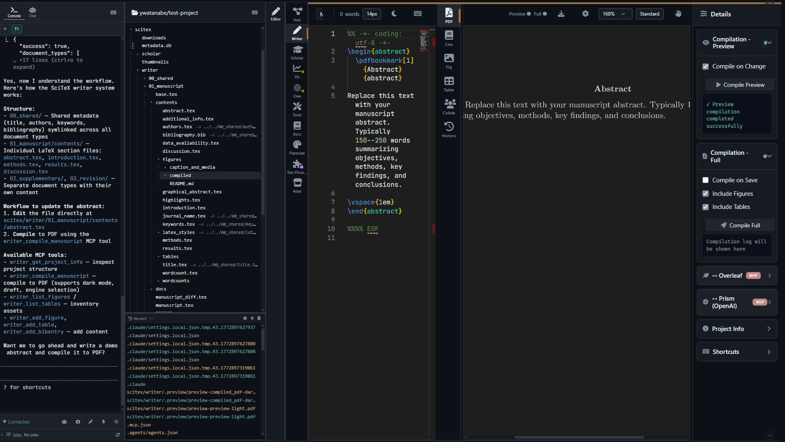
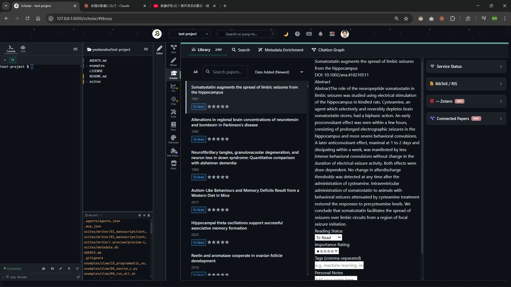
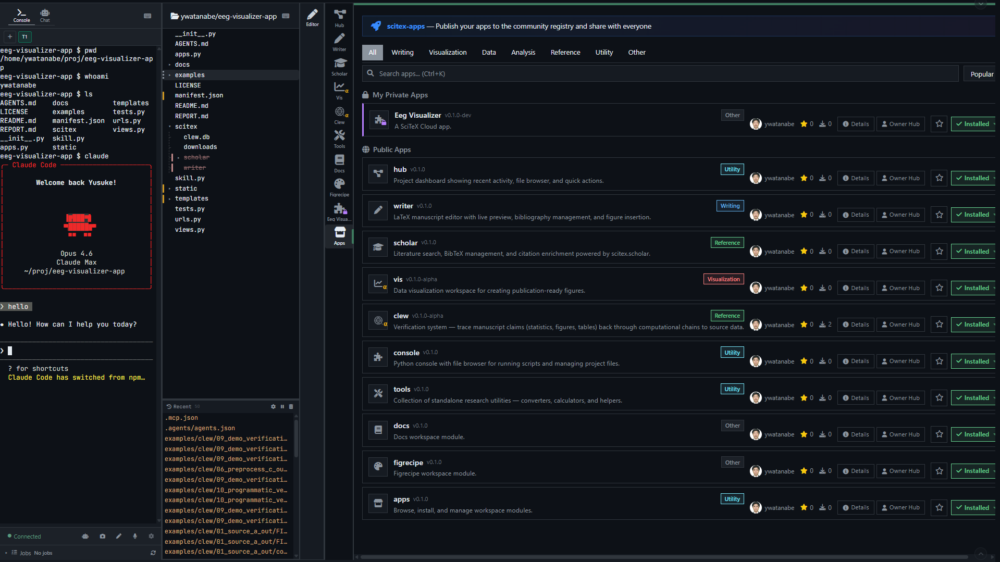

<!-- ---
!-- Timestamp: 2026-03-15 01:17:54
!-- Author: ywatanabe
!-- File: /home/ywatanabe/proj/scitex-cloud/README.md
!-- --- -->

<!-- ---
!-- Timestamp: 2026-03-15
!-- File: /home/ywatanabe/proj/scitex-cloud/README.md
!-- --- -->

# SciTeX Cloud (<code>scitex-cloud</code>)

<p align="center">
  <a href="https://scitex.ai">
    
  </a>
</p>

<p align="center"><b>Open-source scientific research platform — web interface for the SciTeX ecosystem</b></p>

<p align="center">
  <a href="https://pypi.org/project/scitex-cloud/"></a>
  <a href="https://scitex-cloud.readthedocs.io/"></a>
  <a href="https://github.com/ywatanabe1989/scitex-cloud/actions/workflows/tests.yml"></a>
  <a href="https://github.com/ywatanabe1989/scitex-cloud/blob/main/LICENSE"></a>
</p>

<p align="center">
  <a href="https://scitex-cloud.readthedocs.io/">Full Documentation</a> · <code>pip install scitex-cloud</code>
</p>

---

## Problem

Scientific research faces several infrastructure challenges:

1. **Fragmented tools** — literature discovery, manuscript writing, data analysis, and visualization each require separate applications, most of which are proprietary, cloud-locked, or require surrendering data to third-party services. This fragmentation forces researchers to switch context constantly and makes it difficult to build sufficient context for AI agents to assist meaningfully across the research workflow.
2. **Broken provenance** — papers, code, and execution environments are rarely tied together, making it difficult to replicate results or build on existing work — slowing the cumulative progress of science.
3. **No custom tooling** — every research group needs custom tools for their specific needs (e.g., clinical trial dashboards in medical research, spike-sorting interfaces in neuroscience, compound screening pipelines in pharmaceutical sciences, sequence annotation tools in biology), yet building and sharing them requires deep computational knowledge and creating potentially shareable components from scratch.
4. **No research community platform** — no GitHub-like infrastructure exists for research-project-centric, fully traceable, parallel-working collaboration.
5. **No control** — researchers have no ownership over their infrastructure: vendor lock-in, opaque algorithms, unilateral pricing changes, and data policies they cannot influence.
6. **AI tools not research-aware** — existing tools often lack AI assistant capabilities and domain-specific skills for scientific work, unable to operate across the full research lifecycle (literature review, analysis, writing, verification).

Without solid infrastructure, fragmented research workflows will never scale.

## Solution

SciTeX Cloud addresses each of these directly:

1. **Unified platform** — Scholar, Writer, FigRecipe, Console, Hub, and Clew in a single Django web application, deployable anywhere with Docker. All apps share the same project filesystem and integrate through the `scitex` Python package.
2. **Verifiable provenance** — Clew links papers, code, data, and execution environments into a hash-verified DAG (Directed Acyclic Graph), ensuring every result is traceable and reproducible.
3. **App Maker and Store** — researchers create, publish, and install custom research tools without web development experience.
4. **GitHub-style project hub** — repository hosting, pull requests, and community discovery purpose-built for research.
5. **Self-hosted, open-source, runnable from anywhere** — deploy on your laptop, lab server, or cloud. AGPL-3.0 licensed — inspect every line of code, customize freely, no vendor lock-in, no data surrender.
6. **Built-in AI co-pilot** — platform-aware skills via MCP (Model Context Protocol) and CLI span the full research lifecycle: literature search, statistical analysis, figure generation, manuscript writing, and provenance verification.

> **Status**: Alpha (data may be lost between releases)

## Screenshots

| Writer | Scholar | Apps |
|:---:|:---:|:---:|
|  |  |  |

<p align="center"><sub><b>Figure 1.</b> Core application modules. Writer (left) provides a LaTeX manuscript environment with live compilation. Scholar (center) offers literature discovery, BibTeX enrichment, and PDF management. The Apps panel (right) shows the project-centric hub linking all modules.</sub></p>

## Installation

```bash
pip install scitex-cloud              # CLI only
pip install scitex-cloud[mcp]         # CLI + MCP server
pip install scitex-cloud[all]         # Everything
```

## Quick Start

```bash
git clone https://github.com/ywatanabe1989/scitex-cloud.git
cd scitex-cloud
make start                    # Start development environment

# Access at: http://localhost:8000
# Gitea: http://localhost:3000
# Test user: test-user / Password123!
```

## Three Interfaces

<details>
<summary><strong>Python API</strong></summary>

<br>

```python
import scitex_cloud

# Version and health
scitex_cloud.__version__        # "0.15.0"
scitex_cloud.get_version()      # Version string
scitex_cloud.health_check()     # Service health status
```

> **[Full API reference](https://scitex-cloud.readthedocs.io/)**

</details>

<details>
<summary><strong>CLI Commands</strong></summary>

<br>

```bash
scitex-cloud --help                    # Help
scitex-cloud --help-recursive          # All commands recursively
scitex-cloud --version                 # Version

# Git hosting (Gitea)
scitex-cloud gitea list                # List repositories
scitex-cloud gitea clone user/repo     # Clone repository
scitex-cloud gitea push                # Push changes
scitex-cloud gitea pr create           # Create pull request
scitex-cloud gitea issue create        # Create issue

# Docker management
scitex-cloud docker status             # Container status
scitex-cloud docker logs               # View logs

# MCP server
scitex-cloud mcp start                 # Start MCP server
scitex-cloud mcp list-tools            # List available tools
scitex-cloud mcp doctor                # Diagnose setup
scitex-cloud mcp installation          # Client config instructions

# Utilities
scitex-cloud status                    # Deployment status
scitex-cloud completion                # Shell completion setup
scitex-cloud list-python-apis          # List all Python APIs
```

> **[Full CLI reference](https://scitex-cloud.readthedocs.io/)**

</details>

<details>
<summary><strong>MCP Server — for AI Agents</strong></summary>

<br>

AI agents can interact with the SciTeX Cloud platform autonomously via MCP (Model Context Protocol) tools.

| Category | Tools | Description |
|----------|-------|-------------|
| cloud | 14 | Git operations (clone, push, pull, PR, issues) |
| api | 9 | Scholar search, CrossRef, BibTeX enrichment |

<sub><b>Table 1.</b> MCP tool categories. All tools accept JSON parameters and return JSON results. Use <code>scitex-cloud mcp list-tools</code> for the full list.</sub>

**Claude Desktop** (`~/.config/claude/claude_desktop_config.json`):

```json
{
  "mcpServers": {
    "scitex-cloud": {
      "command": "scitex-cloud",
      "args": ["mcp", "start"]
    }
  }
}
```

> **[Full MCP specification](https://scitex-cloud.readthedocs.io/)**

</details>

## Web Platform

<details>
<summary><strong>Deployment</strong></summary>

<br>

```bash
make start                    # Development (default)
make ENV=prod start           # Production
make ENV=prod status          # Health check
make ENV=prod db-backup       # Backup database
make help                     # All available commands
```

</details>

<details>
<summary><strong>Configuration</strong></summary>

<br>

`.env` files in `deployment/docker/envs/` (gitignored):

```bash
.env.dev        # Development
.env.prod       # Production
.env.staging    # Staging
.env.example    # Template (tracked)
```

Key variables:
```bash
SCITEX_CLOUD_DJANGO_SECRET_KEY=your-secret-key
SCITEX_CLOUD_POSTGRES_PASSWORD=strong-password
SCITEX_CLOUD_GITEA_TOKEN=your-token
```

</details>

<details>
<summary><strong>Project Structure</strong></summary>

<br>

```
scitex-cloud/
├── apps/                    # Django applications
│   ├── scholar_app/        # Literature discovery
│   ├── writer_app/         # Scientific writing
│   ├── console_app/        # Terminal & code execution
│   ├── figrecipe_app/      # Data visualization
│   ├── hub_app/            # Project hub & file browser
│   ├── project_app/        # Project management
│   ├── clew_app/           # Verification pipeline
│   └── public_app/         # Landing page & tools
│
├── deployment/docker/
│   ├── docker_dev/         # Development compose
│   ├── docker_prod/        # Production compose
│   └── envs/               # .env files (gitignored)
│
├── config/                  # Django settings
├── static/                  # Shared frontend assets
├── src/scitex_cloud/        # pip package (CLI + MCP)
├── tests/                   # Test suite
└── Makefile                 # Thin dispatcher
```

</details>

## Part of SciTeX

SciTeX Cloud is part of [**SciTeX**](https://scitex.ai). When used with the `scitex` Python package, modules like Scholar, Writer, and FigRecipe share sessions and data automatically:

```python
import scitex

@scitex.session
def main(CONFIG=scitex.INJECTED):
    data = scitex.io.load("input.csv")     # auto-tracked as input
    result = process(data)
    scitex.io.save(result, "output.csv")   # auto-tracked as output
    return 0
```

All file I/O through `scitex.io` is recorded and linked across Cloud modules — Scholar references feed directly into Writer bibliographies, and FigRecipe outputs appear in the project Hub.

The SciTeX system follows the Four Freedoms for Research below, inspired by [the Free Software Definition](https://www.gnu.org/philosophy/free-sw.en.html):

>Four Freedoms for Research
>
>0. The freedom to **run** your research anywhere — your machine, your terms.
>1. The freedom to **study** how every step works — from raw data to final manuscript.
>2. The freedom to **redistribute** your workflows, not just your papers.
>3. The freedom to **modify** any module and share improvements with the community.
>
>AGPL-3.0 — because we believe research infrastructure deserves the same freedoms as the software it runs on.

## Contributing

We welcome contributions! See [CONTRIBUTING.md](CONTRIBUTING.md).

---

<p align="center">
  <a href="https://scitex.ai" target="_blank"></a>
</p>

<!-- EOF -->
