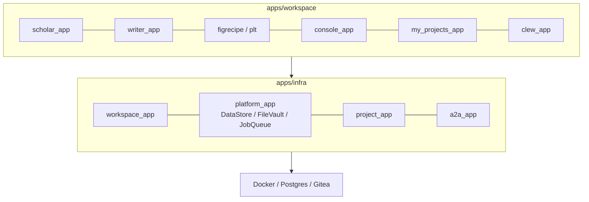

<!-- ---
!-- Timestamp: 2026-03-15 01:57:12
!-- Author: ywatanabe
!-- File: /home/ywatanabe/proj/scitex-hub/README.md
!-- --- -->

<!-- ---
!-- Timestamp: 2026-03-15
!-- File: /home/ywatanabe/proj/scitex-hub/README.md
!-- --- -->

# SciTeX Hub (<code>scitex-hub</code>)

<p align="center">
  
</p>

<!-- scitex-badges:start -->
<p align="center">
  <a href="https://pypi.org/project/scitex-hub/"></a>
  <a href="https://pypi.org/project/scitex-hub/"></a>
  <a href="https://scitex-hub.readthedocs.io/en/latest/"></a>
</p>
<p align="center">
  <a href="https://github.com/scitex-ai/scitex-hub/actions/workflows/pytest-matrix-on-ubuntu-py3-11-3-12-3-13.yml"></a>
  <a href="https://github.com/scitex-ai/scitex-hub/actions/workflows/import-smoke-on-ubuntu-py3-12.yml"></a>
  <a href="https://codecov.io/gh/scitex-ai/scitex-hub"></a>
  <a href="https://www.gnu.org/licenses/agpl-3.0"></a>
</p>
<!-- scitex-badges:end -->

<p align="center">
  <a href="https://scitex-hub.readthedocs.io/en/latest/api/scitex_hub.html">Full Documentation</a> · <code>uv pip install scitex-hub[all]</code>
</p>

---

## Problem and Solution

| # | Problem | Solution |
|---|---------|----------|
| 1 | **Fragmented tools.** Literature, writing, analysis, and visualization need separate, often proprietary apps — forcing context-switching and starving AI agents of cross-workflow context. | **Unified platform.** Scholar, Writer, FigRecipe, Console, Hub, and Clew in one Django app, deployable anywhere with Docker — sharing one project filesystem via the `scitex` package. |
| 2 | **No custom tooling.** Groups need domain tools (trial dashboards, spike-sorting UIs, screening pipelines), yet building and sharing them demands deep computational skill and components from scratch. | **App Maker and Store.** Researchers publish and install custom tools on shared components — permissions, AI infrastructure, containers, and file operations handled by the platform. |
| 3 | **AI tools not research-aware.** Existing tools lack assistant capabilities and domain skills for science, unable to span the full lifecycle — review, analysis, writing, verification. | **Built-in AI co-pilot.** Platform-aware context, skills, MCP tools, and CLI span the full lifecycle — an assistant that grasps the whole project from natural language. |
| 4 | **Review crisis.** The growing volume and heterogeneity of published papers overwhelms a limited, volunteer-based peer review process that cannot scale. | **Open review via Issues and PRs.** GitHub-style tracking and pull requests bring transparent, scalable peer review to research — anyone can inspect, comment, and propose changes. |
| 5 | **Broken provenance.** Papers, code, and environments are rarely tied together, so reviewers cannot verify claims and others cannot replicate results — slowing cumulative progress. | **Verifiable provenance.** Clew links papers, code, data, and environments into a hash-verified DAG — a compressed view of the workflow that cuts what reviewers must check. |
| 6 | **Lost knowledge on handoff.** When researchers leave, successors inherit scattered files with little context and struggle to pick up where the work stopped. | **Seamless project handoff.** Full project state — code, data, provenance, drafts, environment — lives in one place, so successors continue work immediately. |
| 7 | **No research community platform.** No GitHub-like infrastructure exists for research-project-centric, fully traceable, parallel-working collaboration. | **GitHub-style project hub.** Repository hosting and ticket-based development with co-authors and the community enable efficient research advancement and collaboration. |
| 8 | **No control.** Researchers have no ownership over their infrastructure: vendor lock-in, opaque algorithms, unilateral pricing changes, and data policies they cannot influence. | **Self-hosted, open-source, runnable from anywhere.** Deploy on your laptop, lab server, or cloud. AGPL-3.0 licensed — inspect every line, customize freely, no vendor lock-in, no data surrender. |

<sub><b>Table 1.</b> Eight infrastructure challenges in scientific research and how SciTeX Hub addresses each. These gaps fuel the reproducibility crisis, limit what AI can do for research, and leave knowledge stranded when people move on.</sub>

SciTeX Hub is an AI-native infrastructure so that researchers can focus on science, not on tooling.

## Quick Start

```bash
git clone https://github.com/scitex-ai/scitex-hub.git
cd scitex-hub
make start                    # Start development environment

# Access at: http://localhost:8000
# Gitea: http://localhost:3000
# Test user: test-user — the password is printed by `init_test_user` on first run
# (or set SCITEX_HUB_TEST_USER_PASSWORD to choose it yourself)
```

## Demo

<p align="center"><b>Writer</b><br></p>

<p align="center"><sub><b>Figure 1.</b> Writer — LaTeX manuscript environment with live compilation.</sub></p>

<p align="center"><b>Scholar</b><br></p>

<p align="center"><sub><b>Figure 2.</b> Scholar — literature discovery, BibTeX enrichment, and PDF management.</sub></p>

<p align="center"><b>Apps</b><br></p>

<p align="center"><sub><b>Figure 3.</b> Apps — the project-centric hub linking all modules.</sub></p>

## Installation

```bash
uv pip install "scitex-hub[all]"
```

<details>
<summary><strong>Install variants</strong></summary>

| Target | Command | Gets you |
|--------|---------|----------|
| Users (recommended) | `uv pip install "scitex-hub[all]"` | CLI + MCP server + Django stack |
| CLI only | `pip install scitex-hub` | `scitex-hub` commands without the server stack |
| Developers | `pip install -e ".[all,dev]"` | Editable install plus lint/test tooling |

`[dev]` is internal-only (formatters, linters, dev test plugins) and is not part of `[all]`.

</details>

## Architecture



<sub><b>Figure 4.</b> Workspace apps over infra apps over Docker / Postgres / Gitea.</sub>

```
scitex-hub/
├── apps/
│   ├── workspace/         # scholar / writer / figrecipe / console / hub / clew
│   ├── infra/             # workspace_app, platform_app, project_app, a2a_app
│   └── public_app/        # landing page + public tools
├── deployment/docker/     # docker_dev / docker_prod / envs
├── config/                # Django settings
├── src/scitex_hub/      # pip package: CLI + MCP server
└── tests/
```

<sub><b>Figure 5.</b> Repository layout — Django project, pip package, and tests.</sub>

## Four Interfaces

<details open>
<summary><strong>Python API</strong></summary>

<br>

```python
import scitex_hub

# Version and health
scitex_hub.__version__        # read from pyproject.toml (e.g. "0.17.0-alpha")
scitex_hub.get_version()      # Version string
scitex_hub.health_check()     # Local package info
scitex_hub.health_check("https://scitex.ai/api/health/")  # Remote endpoint

# Clients / helpers
client = scitex_hub.CloudClient()            # HTTP client
env = scitex_hub.get_environment()           # Environment config
docker = scitex_hub.DockerManager()          # Container helpers
```

> **[Full API reference](https://scitex-hub.readthedocs.io/en/latest/api/scitex_hub.html)**

</details>

<details>
<summary><strong>CLI Commands</strong></summary>

<br>

```bash
scitex-hub --help                    # Help
scitex-hub --help-recursive          # All commands recursively
scitex-hub --version                 # Version

# Git hosting (Gitea)
scitex-hub gitea list                # List repositories
scitex-hub gitea clone user/repo     # Clone repository
scitex-hub gitea push                # Push changes
scitex-hub gitea pr create           # Create pull request
scitex-hub gitea issue create        # Create issue

# Docker management
scitex-hub docker up                 # Start containers
scitex-hub docker down               # Stop containers
scitex-hub docker ps                 # Container status
scitex-hub docker build              # Build images
scitex-hub docker restart            # Restart services

# MCP server
scitex-hub mcp start                 # Start MCP server
scitex-hub mcp list-tools            # List available tools
scitex-hub mcp doctor                # Diagnose setup
scitex-hub mcp installation          # Client config instructions

# Utilities
scitex-hub status                    # Deployment status
scitex-hub completion                # Shell completion setup
scitex-hub list-python-apis          # List all Python APIs
```

> **[Full CLI reference](https://scitex-hub.readthedocs.io/en/latest/cli/index.html)**

</details>

<details>
<summary><strong>MCP Server — for AI Agents</strong></summary>

<br>

AI agents can interact with the SciTeX Hub platform autonomously via MCP (Model Context Protocol) tools.

| Category | Tools | Description |
|----------|-------|-------------|
| gitea | 14 | Git operations (clone, push, pull, PR, issues, auth) |
| sdk | 14 | DataStore, FileVault, JobQueue operations |
| api | 9 | Scholar search, CrossRef, BibTeX enrichment |
| app | 7 | App plugin lifecycle (init, validate, submit) |
| onsite | 6 | On-site platform operations |
| project_crud | 5 | Project create, list, rename, delete |

<sub><b>Table 2.</b> MCP tool categories — 55 tools total registered via
<code>register_all_tools</code> in
<code>_mcp_tools/__init__.py</code>. Use <code>scitex-hub mcp list-tools</code>
for the live list.</sub>

**Claude Desktop** (`~/.config/claude/claude_desktop_config.json`):

```json
{
  "mcpServers": {
    "scitex-hub": {
      "command": "scitex-hub",
      "args": ["mcp", "start"]
    }
  }
}
```

> **[Full MCP specification](https://scitex-hub.readthedocs.io/en/latest/mcp/index.html)**

</details>

<details>
<summary><strong>Skills — for AI Agents</strong></summary>

<br>

Skill files provide context-aware guidance to AI agents working within the SciTeX ecosystem.

```bash
# Export skills to dotfiles (sync to Claude)
scitex-dev skills export --package scitex-hub

# List available skills
scitex-hub skills list
```

Skills are stored in `src/scitex_hub/_skills/scitex-hub/` and cover deployment, development, testing, and more.

> **[Skills index](_skills/scitex-hub/SKILL.md)**

</details>

## Web Platform

<details>
<summary><strong>Deployment</strong></summary>

<br>

```bash
make start                    # Development (default)
make ENV=prod start           # Production
make ENV=prod status          # Health check
make ENV=prod db-backup       # Backup database
make help                     # All available commands
```

</details>

<details>
<summary><strong>Configuration</strong></summary>

<br>

`.env` files in `deployment/docker/envs/` (gitignored):

```bash
.env.dev        # Development
.env.prod       # Production
.env.staging    # Staging
.env.example    # Template (tracked)
```

Key variables:
```bash
SCITEX_HUB_DJANGO_SECRET_KEY=your-secret-key
SCITEX_HUB_POSTGRES_PASSWORD=strong-password
SCITEX_HUB_GITEA_TOKEN=your-token
```

</details>

<details>
<summary><strong>Project Structure</strong></summary>

<br>

```
scitex-hub/
├── apps/                    # Django applications
│   ├── workspace/          # Workspace modules
│   │   ├── apps_app/      # App marketplace & dev install
│   │   ├── scholar_app/   # Literature discovery
│   │   ├── writer_app/    # Scientific writing
│   │   ├── console_app/   # Terminal & code execution
│   │   ├── my_projects_app/       # Project hub & file browser
│   │   └── clew_app/      # Verification pipeline
│   ├── infra/             # Platform infrastructure
│   │   ├── workspace_app/ # Module registry & workspace shell
│   │   ├── platform_app/  # DataStore, FileVault, JobQueue APIs
│   │   └── project_app/   # Project management
│   └── public_app/        # Landing page & public tools
│
├── deployment/docker/
│   ├── docker_dev/         # Development compose
│   ├── docker_prod/        # Production compose
│   └── envs/               # .env files (gitignored)
│
├── config/                  # Django settings
├── static/                  # Shared frontend assets
├── src/scitex_hub/        # pip package (platform CLI + MCP)
├── tests/                   # Test suite
└── Makefile                 # Thin dispatcher
```

<sub><b>Figure 6.</b> Expanded layout — frontend assets, settings, and entry points.</sub>

> **For app developers:** Use `pip install scitex-app[cli]` and the `scitex-app app` CLI.
> scitex-hub is the platform server — app developers don't need to install it.

</details>

## Part of SciTeX

`scitex-hub` is part of [**SciTeX**](https://scitex.ai). Install via
the umbrella with `pip install scitex[hub]` to use as
`scitex.hub` (Python) or `scitex hub ...` (CLI).

| From | Produces | To | Outcome |
|------|----------|----|---------|
| **Scholar** | Citations as cards | **Writer** | Convenient, evidence-based referencing |
| **SciTeX-followed Analysis** | Artifacts | **Writer** | AI writes a manuscript based on actual results |
| **FigRecipe** | Style-editable, composable figures | **Writer** | Publication-ready figures in context |
| **Clew** | Verification and DAG visualization | **Writer** | Proven reproducibility for every claim |

The SciTeX system follows the Four Freedoms for Research below, inspired by [the Free Software Definition](https://www.gnu.org/philosophy/free-sw.en.html):

>Four Freedoms for Research
>
>0. The freedom to **run** your research anywhere — your machine, your terms.
>1. The freedom to **study** how every step works — from raw data to final manuscript.
>2. The freedom to **redistribute** your workflows, not just your papers.
>3. The freedom to **modify** any module and share improvements with the community.
>
>AGPL-3.0 — because we believe research infrastructure deserves the same freedoms as the software it runs on.

## A2A Protocol Surface

scitex-hub serves the [Google A2A protocol](https://a2a-protocol.org/) at **`a2a.scitex.ai`** for the orochi agent fleet — AgentCard discovery, JSON-RPC dispatch, bearer-auth via Gitea PAT, and a Tier 3 forwarder to live agents. See [`apps/infra/a2a_app/README.md`](apps/infra/a2a_app/README.md).

```bash
curl https://a2a.scitex.ai/v1/agents/ | jq '.agents | length'
```

## Status

SciTeX Hub is in **alpha**. Core functionality is working and under active development. Data formats may change between releases — back up important work.

## Contributing

We welcome contributions! See [CONTRIBUTING.md](CONTRIBUTING.md).

---

<p align="center">
  <a href="https://scitex.ai" target="_blank"></a>
</p>

<!-- EOF -->
