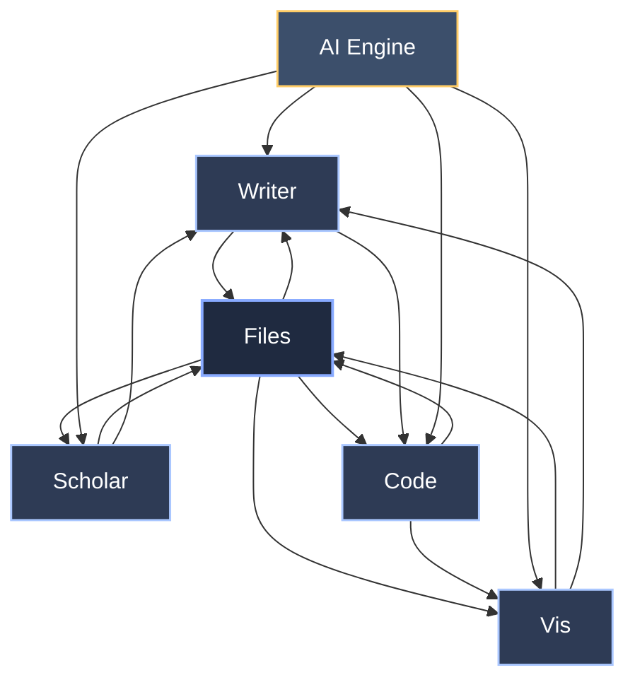

<!-- ---
!-- Timestamp: 2025-12-06 05:23:55
!-- Author: ywatanabe
!-- File: /home/ywatanabe/proj/scitex-hub/docs/ARCHITECTURE_00.md
!-- --- -->

# SciTeX Hub Architecture

## Table of Contents
1. [Application Architecture](#application-architecture)
2. [Infrastructure Architecture](#infrastructure-architecture)
3. [Service Details](#service-details)
4. [Communication Flows](#communication-flows)
5. [Configuration](#configuration)

---

## Application Architecture

### SciTeX Ecosystem Overview

**SciTeX Hub**: Live at https://scitex.ai (Dev: http://127.0.0.1:8000)

**Core Modules:**
- **Files**: http://127.0.0.1:8000/\<username\>/\<project-name\>
- **Writer**: http://127.0.0.1:8000/writer/
- **Scholar**: http://127.0.0.1:8000/scholar/bibtex/
- **Vis**: http://127.0.0.1:8000/vis/vis/
- **Code**: http://127.0.0.1:8000/console/

### Module Capabilities

#### SciTeX Writer
- GitHub: https://github.com/ywatanabe1989/scitex-writer
- Package: `pip install scitex` → `import scitex.writer`
- Features:
  - Section-separated writing
  - Collaborative editing
  - AI-native (always linked to Files)
  - Statistics incorporation (optional with scitex.stats)
  - Context-aware (integrates Scholar, Vis, Code, Files)

#### SciTeX Scholar
- Location: https://github.com/ywatanabe1989/scitex-code/src/scitex/scholar
- Package: `pip install scitex` → `import scitex.scholar`
- Features:
  - Abstract appending (AI-native)
  - Citation enrichment
  - Auto-metadata

#### SciTeX Vis
- Location: https://github.com/ywatanabe1989/scitex-code/src/scitex/{plt,vis}
- Package: `pip install scitex` → `import scitex.plt`, `import scitex.vis`
- Features:
  - **Reproducibility:**
    - Metadata embedded
    - CSV created
    - JSON created (style)
    - Plot ↔ text data
  - **Flexibility:**
    - Style change
    - mm-level adjustment
  - **UI:**
    - GUI for layout
    - GUI for style change
  - Optional: Statistics with scitex.stats, Metadata with scitex.plt

#### SciTeX Code
- Location: https://github.com/ywatanabe1989/scitex-code/src/scitex/{io,logging,plt,vis,...}
- Package: `pip install scitex` → `import scitex`
- Features:
  - Works in local, scitex.ai, and self-hostable
  - Reusable, reproducible modules available

### Module Integration Diagram

Each module works independently but gains synergy through loose coupling:



---

## Infrastructure Architecture

### Deployment Overview (Production)

SciTeX Hub runs on a UGREEN DXP480T Plus server with the following stack:

```mermaid
graph TB
    subgraph HOST["Host Machine: UGREEN DXP480T Plus Server"]
        SLURM["SLURM Workload Manager<br/>(slurmctld + slurmd)<br/>Partitions: express, normal, long"]
        MUNGE["Munge Authentication Service<br/>Socket: /var/run/munge"]
        APPTAINER["Apptainer Container Runtime<br/>Version 1.3.4"]
        HOST_USER["Host User Account<br/>Username: scitex, UID: 1000"]
    end

    subgraph DOCKER["Docker Network: scitex-network"]
        subgraph EDGE["Edge Services Layer"]
            CLOUDFLARED["Cloudflare Tunnel<br/>Domain: scitex.ai"]
            NGINX["Nginx Reverse Proxy<br/>Ports: 80, 443"]
        end

        subgraph APP["Application Services Layer"]
            DJANGO["Django Framework + Daphne ASGI<br/>Port: 8000"]
            CELERY_WORKER["Celery Distributed Task Queue<br/>Worker Process"]
            CELERY_BEAT["Celery Beat Scheduler<br/>Periodic Tasks"]
            FLOWER["Flower Monitoring Dashboard<br/>Port: 5555"]
        end

        subgraph STORAGE["Data Persistence Layer"]
            POSTGRES["PostgreSQL Database v15<br/>Port: 5432"]
            REDIS["Redis Cache + Message Broker<br/>Port: 6379"]
        end

        subgraph SERVICES["External Services Layer"]
            GITEA["Gitea Git Server<br/>HTTP: 3000, SSH: 2222"]
            CROSSREF["Crossref REST API<br/>Port: 8001"]
        end
    end

    subgraph GATEWAY["SSH Gateway Services"]
        SSH_WORKSPACE["Workspace SSH Gateway<br/>Port: 2200"]
        SSH_GITEA["Gitea SSH Gateway<br/>Port: 2222"]
    end

    %% External Network
    INTERNET["Internet Traffic"] --> CLOUDFLARED

    %% Request Flow
    CLOUDFLARED --> NGINX
    NGINX -->|"API Requests"| DJANGO
    NGINX -->|"Static Assets"| DJANGO
    NGINX -->|"Monitoring"| FLOWER
    NGINX -->|"Git Subdomain"| GITEA

    %% Application Dependencies
    DJANGO -->|"SQL Operations"| POSTGRES
    DJANGO -->|"Cache Operations"| REDIS
    DJANGO -->|"Task Queue"| REDIS
    DJANGO -->|"Citation Queries"| CROSSREF
    DJANGO -->|"Repository Operations"| GITEA
    DJANGO -.->|"Container Management"| HOST
    DJANGO -.->|"Job Submission"| SLURM
    DJANGO -.->|"Authentication"| MUNGE

    %% Worker Dependencies
    CELERY_WORKER -->|"Task Retrieval"| REDIS
    CELERY_WORKER -->|"Data Access"| POSTGRES
    CELERY_BEAT -->|"Task Scheduling"| REDIS
    FLOWER -->|"Queue Monitoring"| REDIS

    %% Host Service Dependencies
    SLURM -.->|"Credential Validation"| MUNGE
    SLURM -.->|"Container Execution"| APPTAINER
    SLURM -.->|"User Management"| HOST_USER

    %% Gateway Connections
    SSH_WORKSPACE -.->|"Terminal Sessions"| DJANGO
    SSH_GITEA -.->|"Git Protocol"| GITEA

    %% Academic Color Scheme
    classDef hostService fill:#e3f2fd,stroke:#1565c0,stroke-width:2px,color:#0d47a1
    classDef edgeService fill:#fff3e0,stroke:#e65100,stroke-width:2px,color:#bf360c
    classDef appService fill:#f3e5f5,stroke:#6a1b9a,stroke-width:2px,color:#4a148c
    classDef storageService fill:#e8f5e9,stroke:#2e7d32,stroke-width:2px,color:#1b5e20
    classDef serviceLayer fill:#fff9c4,stroke:#f57f17,stroke-width:2px,color:#e65100
    classDef gateway fill:#fce4ec,stroke:#c2185b,stroke-width:2px,color:#880e4f

    %% Apply Styles
    class SLURM,MUNGE,APPTAINER,HOST_USER hostService
    class CLOUDFLARED,NGINX edgeService
    class DJANGO,CELERY_WORKER,CELERY_BEAT,FLOWER appService
    class POSTGRES,REDIS storageService
    class GITEA,CROSSREF serviceLayer
    class SSH_WORKSPACE,SSH_GITEA gateway
```



---

## Service Details

### Edge Layer

#### Cloudflared
- **Purpose**: Secure tunnel to Cloudflare (replaces port forwarding)
- **Configuration**: `/etc/cloudflared/config.yml`
- **Domain**: scitex.ai
- **Health Check**: Tunnel status monitored via Django API
- **Benefits**: No exposed ports, automatic SSL, DDoS protection

#### Nginx
- **Purpose**: Reverse proxy, SSL termination, static file serving
- **Configuration**: `deployment/docker/common/nginx/nginx_prod.conf`
- **Routes**:
  - `/` → Django (main app)
  - `/flower/` → Flower (Celery monitor)
  - `git.scitex.ai` → Gitea
  - `/static/` → Static files
  - `/media/` → Media files
- **Dependencies**: Django, Flower, Gitea
- **Port Mapping**: Host 8000 → Container 80

### Application Layer

#### Django (Daphne ASGI)
- **Purpose**: Main application server with WebSocket support
- **ASGI Server**: Daphne 4.1.2
- **Configuration**: `config/settings/settings_prod.py`
- **Environment**: `SECRET/.env.prod`
- **Port**: 8000
- **Special Mounts**:
  - `/var/run/docker.sock` → Manage user workspace containers
  - `/etc/slurm/slurm.conf` → SLURM integration
  - `/var/run/munge` → Munge authentication
- **Dependencies**: PostgreSQL (must be healthy), Redis, Crossref
- **User**: `scitex` (UID 1000)

#### Celery Worker
- **Purpose**: Background task execution
- **Tasks**:
  - Chart generation (matplotlib)
  - Email sending
  - Data cleanup
  - PDF compilation
- **Broker**: Redis (redis://redis:6379/0)
- **Backend**: PostgreSQL
- **Concurrency**: Auto (based on CPU cores)
- **Dependencies**: Redis (broker), PostgreSQL (results)

#### Celery Beat
- **Purpose**: Scheduled task dispatcher (cron-like)
- **Schedule**: Defined in `config/celery.py`
- **Key Tasks**:
  - `generate_charts`: Every 1 minute
  - `cleanup_expired_sessions`: Daily
- **Dependencies**: Redis

#### Flower
- **Purpose**: Celery monitoring dashboard
- **Port**: 5555
- **Access**: `/flower/` (via Nginx)
- **Authentication**: Django session-based
- **Features**: Task monitoring, worker management, task history

### Storage Layer

#### PostgreSQL 15
- **Purpose**: Primary relational database
- **Port**: 5432
- **Volume**: `postgres_data` (persistent)
- **Database**: `scitex`
- **User**: `scitex`
- **Health Check**: Connection check every 10s
- **Schema**: Django ORM managed
- **Tables**: Users, Projects, Files, Metrics, Sessions, Celery Results

#### Redis
- **Purpose**: Cache, sessions, Celery message broker
- **Port**: 6379
- **Volume**: `redis_data` (persistent)
- **Health Check**: Ping check every 10s
- **Use Cases**:
  - Django cache backend
  - Session storage
  - Celery task queue
  - Visitor pool allocation

### Service Layer

#### Gitea
- **Purpose**: Git repository hosting
- **Ports**:
  - HTTP: 3000 (internal)
  - SSH: 2222 (exposed to host)
- **Volume**: `gitea_data` (repos, database, config)
- **Features**:
  - User project repositories
  - SSH key management
  - Webhooks (future: CI/CD integration)
- **Database**: SQLite (internal, within volume)

#### Crossref
- **Purpose**: Citation metadata API with local caching
- **Port**: 8001
- **Database**: SQLite `/data/crossref.db`
- **Features**:
  - DOI lookup caching
  - Reduces external API calls
  - Fast citation retrieval
- **Performance**: ~100ms avg response (cached)

### Host Services

#### SLURM Cluster
- **Purpose**: HPC job scheduler for user terminal workspaces
- **Components**:
  - `slurmctld`: Controller daemon
  - `slurmd`: Compute daemon
- **Partitions**:
  - `express`: 4 hours max (default for terminals)
  - `normal`: 24 hours max
  - `long`: 7 days max
- **Node**: DXP480TPLUS-994 (single node)
- **Configuration**: `/etc/slurm/slurm.conf`
- **Authentication**: Munge

#### Munge
- **Purpose**: Authentication between Django ↔ SLURM
- **Socket**: `/var/run/munge/munge.socket.2`
- **Key**: `/etc/munge/munge.key`
- **Security**: Key must match between host and Django container

#### Apptainer 1.3.4
- **Purpose**: Container runtime for user workspaces (Docker alternative for HPC)
- **Used By**: SLURM jobs for user terminals
- **Configuration**: `/etc/apptainer/`
- **Features**:
  - Rootless containers
  - OCI compatible
  - GPU passthrough support

### SSH Gateways

#### Workspace SSH Gateway
- **Port**: 2200 (host) → SLURM jobs
- **Purpose**: User terminal access
- **Authentication**: Django-managed SSH keys
- **Flow**: SSH → Django → SLURM → Apptainer container

#### Gitea SSH Gateway
- **Port**: 2222 (host) → Gitea
- **Purpose**: Git operations (clone, push, pull)
- **Authentication**: User SSH keys registered in Gitea

---

## Communication Flows

### User Terminal Creation

1. **User Action**: Clicks "New Terminal" in Django UI
2. **Django → SLURM**: Executes `srun --partition=express --pty apptainer shell docker://ubuntu:latest`
3. **SLURM → Munge**: Authenticates request
4. **SLURM → Apptainer**: Launches container with user environment
5. **Django ← WebSocket**: Streams terminal I/O in real-time
6. **Cleanup**: Terminal destroyed when user disconnects or timeout

### Chart Generation (Celery Task)

1. **Celery Beat → Redis**: Schedules `generate_charts` task (every 1 minute)
2. **Celery Worker ← Redis**: Picks up task from queue
3. **Worker → PostgreSQL**: Queries `ServerMetrics` table for historical data
4. **Worker → Matplotlib**: Generates 48 chart variants:
   - 8 metrics × 3 time ranges × 2 themes = 48 PNGs
5. **Worker → Filesystem**: Saves to `/tmp/scitex_charts/`
6. **Django → Filesystem**: Serves charts to users via API endpoints

### Git Push Flow

1. **User**: Executes `git push` via SSH (port 2222)
2. **Gitea SSH Gateway → Gitea**: Authenticates and routes request
3. **Gitea → Filesystem**: Updates repository in `gitea_data` volume
4. **Gitea Webhook → Django** (future): Triggers CI/CD pipeline

### Health Monitoring

1. **Browser → Nginx → Django**: Requests `/api/server-health/`
2. **Django**: Aggregates health from all services:
   - Database: Connection test
   - Redis: Ping test
   - SLURM: Job submission test
   - Apptainer: Container execution test
   - Docker: Container status check
3. **Django → Browser**: Returns JSON with status:
   - `healthy` (green): All systems operational
   - `starting` (green, flashing): Services initializing
   - `warning` (yellow): Non-critical issues
   - `error` (red): Critical failures
4. **Header Indicator**: Updates every 15 seconds

---

## Configuration

### Environment-Specific Settings

#### Production (`settings_prod.py`)
- **DEBUG**: `False`
- **ALLOWED_HOSTS**: `['scitex.ai', '*.scitex.ai', 'localhost']`
- **DATABASE**: PostgreSQL (not SQLite)
- **STATIC_ROOT**: `/app/staticfiles/`
- **MEDIA_ROOT**: `/app/media/`
- **CELERY_BROKER**: `redis://redis:6379/0`
- **CACHE_BACKEND**: Redis
- **VISITOR_POOL_SIZE**: `16`
- **SLURM_PARTITION**: `express`

#### Dev Local (`settings_dev.py`)
- **DEBUG**: `True`
- **ALLOWED_HOSTS**: `['*']`
- **DATABASE**: PostgreSQL
- **Hot Reload**: Enabled via volume mounts
- **VISITOR_POOL_SIZE**: `4`

### Docker Compose Structure

**File**: `deployment/docker/docker_prod/docker-compose.yml`

**Networks**:
- `scitex-network`: Bridge network for all services

**Volumes**:
- `postgres_data`: PostgreSQL database files
- `redis_data`: Redis persistence
- `gitea_data`: Git repositories and Gitea config
- `crossref_data`: Citation cache database

**Build Context**: Root directory (`../../..`)

**Health Checks**: All services have health checks with retries

### Key Configuration Files

- **Django Settings**: `config/settings/settings_{shared,dev,prod}.py`
- **Environment Vars**: `SECRET/.env.{dev,prod}`
- **Nginx Config**: `deployment/docker/common/nginx/nginx_prod.conf`
- **Cloudflare Tunnel**: `/etc/cloudflared/config.yml` (on host)
- **SLURM Config**: `/etc/slurm/slurm.conf` (on host)
- **Celery Config**: `config/celery.py`
- **Docker Compose**: `deployment/docker/docker_prod/docker-compose.yml`

### Port Mappings

| Service | Container Port | Host Port | Purpose |
|---------|---------------|-----------|---------|
| Nginx | 80, 443 | 8000 | HTTP/HTTPS |
| Django | 8000 | - | ASGI app (internal) |
| PostgreSQL | 5432 | - | Database (internal) |
| Redis | 6379 | - | Cache/Queue (internal) |
| Gitea HTTP | 3000 | - | Web UI (via Nginx) |
| Gitea SSH | 2222 | 2222 | Git operations |
| Workspace SSH | - | 2200 | Terminal access |
| Flower | 5555 | - | Celery monitor (via Nginx) |
| Crossref | 8001 | - | Citation API (internal) |

### Volume Persistence

**Persistent Volumes** (survive container restart):
- `postgres_data`: Critical - all user data
- `redis_data`: Cache - can be rebuilt
- `gitea_data`: Critical - all repositories
- `crossref_data`: Cache - can be rebuilt

**Bind Mounts** (production only, no dev volume mounts):
- None - code baked into image for production

---

## Monitoring & Health

### Health Check Endpoints

- **Overall Health**: `GET /api/server-health/`
  - Returns: `{status, color, services}`
  - Status: `healthy`, `warning`, `error`, `starting`

- **Detailed Metrics**: `GET /api/server-status/`
  - Returns: CPU, Memory, Disk, GPU, Network, Pool, Users

- **Historical Data**: `GET /api/server-metrics/history/`
  - Parameters: `hours`, `limit`

### Monitoring Tools

- **Flower**: Celery task monitoring (`/flower/`)
- **Django Admin**: User/Project management (`/admin/`)
- **Logs**: `docker logs <container>`
- **Metrics Dashboard**: `/server-status/`

### Backup Strategy

**Critical Data**:
1. PostgreSQL database (`postgres_data`)
2. Gitea repositories (`gitea_data`)
3. User uploaded files (`/app/media/`)

**Backup Schedule** (recommended):
- Daily: Incremental database backup
- Weekly: Full backup of all volumes
- Monthly: Off-site backup

---

## Scaling & Performance

### Current Capacity (Production)

- **VISITOR_POOL_SIZE**: 16 concurrent anonymous users
- **SLURM Nodes**: 1 (can scale to multiple)
- **CPU**: Shared among all services
- **Memory**: 12-20% utilization typical
- **Disk**: 19% utilization (expandable)

### Optimization Points

1. **Chart Generation**: Pre-generated every minute (reduces real-time load)
2. **Redis Caching**: Sessions, API responses, query results
3. **Nginx**: Static file serving, gzip compression
4. **Celery**: Async processing for heavy tasks
5. **SLURM**: Resource allocation per user terminal

### Future Scaling

- **Horizontal**: Add SLURM compute nodes
- **Vertical**: Increase server resources
- **CDN**: Cloudflare caching for static assets
- **Database**: Read replicas for analytics

---

## Security

### Authentication

- **Django**: Session-based (stored in Redis)
- **SLURM**: Munge authentication
- **Gitea**: SSH keys + passwords
- **API**: CSRF protection enabled

### Network Security

- **Cloudflare Tunnel**: No exposed ports, automatic DDoS protection
- **Internal Network**: Docker bridge network isolation
- **SSH**: Key-based authentication only

### Container Security

- **Non-root User**: Django runs as `scitex` (UID 1000)
- **Read-only Mounts**: Where possible
- **Security Updates**: Regular base image updates

---

## Troubleshooting

### Common Issues

**1. Services show "starting" for too long**
- Check logs: `docker logs scitex-hub-prod-<service>-1`
- Verify dependencies: PostgreSQL must be healthy first

**2. SLURM jobs fail**
- Check Munge: `systemctl status munge`
- Verify UID sync: Host scitex (1000) = Container scitex (1000)
- Test: `docker exec django su scitex -c "srun hostname"`

**3. Charts not updating**
- Check Celery: `docker logs scitex-hub-prod-celery_worker-1`
- Verify Flower: http://localhost:8000/flower/
- Check filesystem: `ls -la /tmp/scitex_charts/`

**4. Git push fails**
- Verify SSH port: `nc -zv localhost 2222`
- Check Gitea logs: `docker logs scitex-hub-prod-gitea-1`
- Verify keys: Gitea web UI → Settings → SSH Keys

### Debug Commands

```bash
# Service status
make ENV=prod status

# View logs
docker logs scitex-hub-prod-django-1 --tail 100 -f

# Execute command in container
docker exec -it scitex-hub-prod-django-1 bash

# Check SLURM from container
docker exec scitex-hub-prod-django-1 su scitex -c "sinfo"

# Test database connection
docker exec scitex-hub-prod-django-1 python manage.py dbshell

# Clear Redis cache
docker exec scitex-hub-prod-redis-1 redis-cli FLUSHALL

# Restart services
make ENV=prod restart
```

---

## References

- **Django**: https://docs.djangoproject.com/
- **Daphne**: https://github.com/django/daphne
- **Celery**: https://docs.celeryproject.org/
- **SLURM**: https://slurm.schedmd.com/documentation.html
- **Apptainer**: https://apptainer.org/docs/
- **Cloudflare Tunnel**: https://developers.cloudflare.com/cloudflare-one/connections/connect-apps/

---

**Last Updated**: 2025-12-06
**Maintained By**: SciTeX Development Team

<!-- EOF -->
