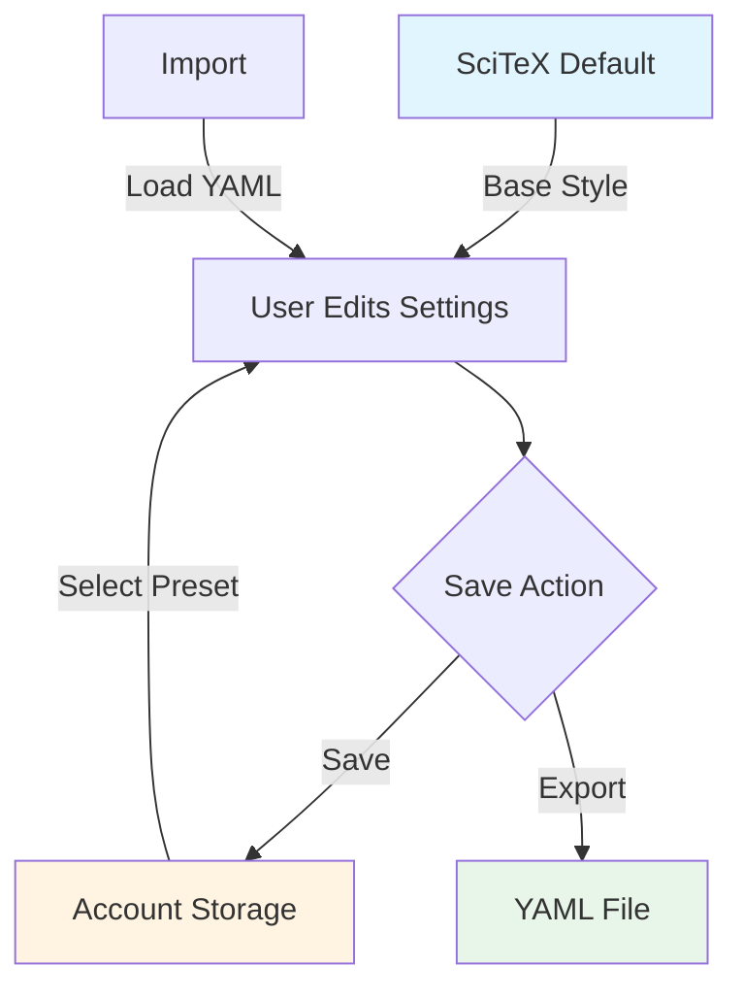
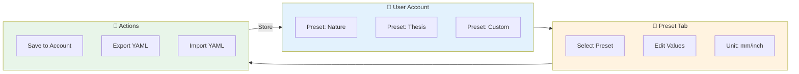
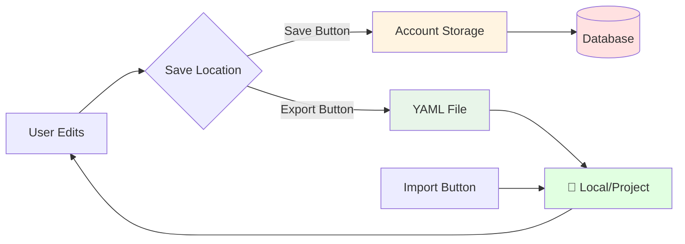

# SciTeX Style Preset System Guide

## Overview

The SciTeX Style Preset system allows users to customize and save their preferred figure styling configurations.

---

## Visual Guide: How Presets Work



---

## Figure Anatomy: Margins & Cropping

```
┌─────────────────────────────────────────────────────┐
│                  Top Margin (20mm)                  │
│  ┌───────────────────────────────────────────────┐  │
│  │                                               │  │
│L │              Axes Area                        │R │
│e │          (Width × Height)                     │i │
│f │                                               │g │
│t │            ┌──────────────┐                   │h │
│  │            │              │                   │t │
│M │            │   Plot       │                   │  │
│a │            │   Content    │                   │M │
│r │            │              │                   │a │
│g │            └──────────────┘                   │r │
│i │                                               │g │
│n │                                               │i │
│  │                                               │n │
│  │                                               │  │
│  └───────────────────────────────────────────────┘  │
│                Bottom Margin (20mm)                 │
└─────────────────────────────────────────────────────┘
                         │
                         ▼
                  [Auto Crop ON]
                         │
                         ▼
        ┌──────────────────────────────┐
        │                              │
        │        Final Figure          │
        │    (Whitespace Removed)      │
        │                              │
        └──────────────────────────────┘
```

**Key Points:**
- **Margins are applied BEFORE cropping** - They create breathing room during rendering
- **Auto Crop removes excess whitespace** - Final figure is tightly bounded
- **Axes Dimensions** - The actual plot area (width × height)

---

## Preset Workflow



---

## Preset Settings Explained

### 📐 Axes Dimensions
| Setting | Description | Units |
|---------|-------------|-------|
| **Width** | Axes width | mm/inch |
| **Height** | Axes height | mm/inch |
| **Thickness** | Spine line width | mm |

**Note:** These define the plot area size, NOT the final figure size!

---

### 📏 Margins (before crop)
| Setting | Description | Effect |
|---------|-------------|--------|
| **Left** | Left margin | Space for Y-axis labels |
| **Right** | Right margin | Space for colorbars |
| **Bottom** | Bottom margin | Space for X-axis labels |
| **Top** | Top margin | Space for titles |

**Important:** Margins are added during rendering, then removed by auto-crop if enabled.

---

### 🔤 Fonts
| Setting | Description | Default |
|---------|-------------|---------|
| **Family** | Font name | Arial |
| **Axis Font Size** | X/Y labels | 7 pt |
| **Tick Font Size** | Tick labels | 7 pt |
| **Title Font Size** | Plot title | 8 pt |
| **Legend Font Size** | Legend text | 6 pt |

---

### ✏️ Lines & Ticks
| Setting | Description | Units |
|---------|-------------|-------|
| **Trace Thickness** | Plot line width | mm |
| **Tick Length** | Tick mark length | mm |
| **Tick Thickness** | Tick mark width | mm |
| **N Ticks** | Target tick count | number |

---

### 🖼️ Output
| Setting | Description | Values |
|---------|-------------|--------|
| **DPI** | Resolution | 300 (publication) |
| **Transparent Background** | Background opacity | ☑ ON / ☐ OFF |
| **Auto Crop** | Remove whitespace | ☑ ON / ☐ OFF |

---

## Storage Locations



### Account Storage (Database)
- ✅ Available across all projects
- ✅ Synced with user account
- ✅ Managed via dropdown selector
- ⚠️ Requires login

### YAML Files
- ✅ Shareable with team
- ✅ Version control friendly
- ✅ Project-specific configs
- ⚠️ Manual import needed

---

## Example YAML Export

```yaml
# SciTeX Style Configuration
axes_width_mm: 40
axes_height_mm: 28
axes_thickness_mm: 0.2

margin_left_mm: 20
margin_right_mm: 20
margin_bottom_mm: 20
margin_top_mm: 20

font_family: Arial
axis_font_size_pt: 7
tick_font_size_pt: 7
title_font_size_pt: 8
legend_font_size_pt: 6

trace_thickness_mm: 0.2
tick_length_mm: 0.8
tick_thickness_mm: 0.2
n_ticks: 4

dpi: 300
transparent: true
auto_crop: true
```

---

## Quick Reference

| Action | Button | Result |
|--------|--------|--------|
| Switch preset | Dropdown | Load saved settings |
| Edit values | Input fields | Modify current preset |
| Toggle units | mm/inch buttons | Change display units |
| Save preset | **Save** | Store to account |
| Share preset | **Export** | Download YAML |
| Load preset | **Import** | Upload YAML |

---

## Best Practices

### ✅ DO
- Use **SciTeX Default** as starting point
- Save presets with **descriptive names** (e.g., "Nature 2-column")
- Export presets to **version control** for team sharing
- Test with **Auto Crop ON** for final output
- Use **mm** for precision, **inch** for familiarity

### ❌ DON'T
- Don't modify **SciTeX Default** (it's read-only)
- Don't use tiny margins with **Auto Crop OFF**
- Don't forget to **Save** after editing
- Don't use non-standard fonts without team agreement

---

## Troubleshooting

| Problem | Solution |
|---------|----------|
| Preset not saving | Check login status, try different name |
| YAML import fails | Validate YAML syntax, check file format |
| Margins too large | Enable **Auto Crop** to remove excess |
| Text cut off | Increase relevant margin (left/bottom) |
| Unit conversion wrong | Check if value is in correct base unit (mm) |

---

**Last Updated:** 2025-12-17
**SciTeX Version:** 0.5.2-alpha
