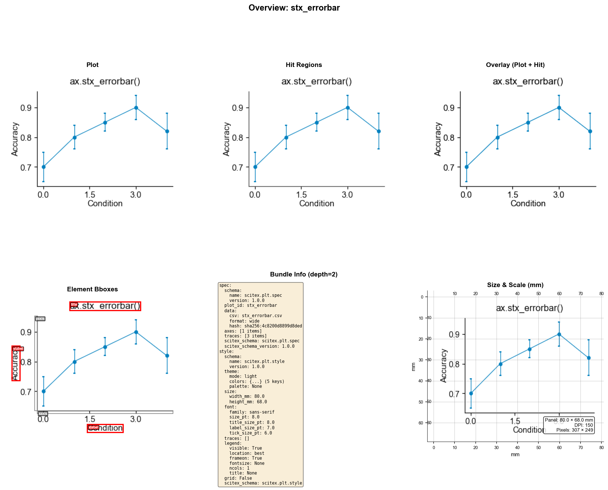

# stx_errorbar.pltz.d

> SciTeX Layered Plot Bundle - Auto-generated README

## Overview



## Bundle Structure

```
stx_errorbar.pltz.d/
├── spec.json           # WHAT to plot (semantic, editable)
├── style.json          # HOW it looks (appearance, editable)
├── stx_errorbar.csv      # Raw data (immutable)
├── exports/
│   ├── stx_errorbar.png          # Main plot image
│   ├── stx_errorbar.svg          # Vector version
│   ├── stx_errorbar_hitmap.png   # Hit detection image
│   └── stx_errorbar_overview.png # Visual summary
├── cache/
│   ├── geometry_px.json       # Pixel coordinates (regenerable)
│   └── render_manifest.json   # Render metadata
└── README.md           # This file
```

## Plot Information

| Property | Value |
|----------|-------|
| Plot ID | `stx_errorbar` |
| Axes | 1 |
| Traces | 3 |
| Size | 80.0 × 68.0 mm |
| DPI | 150 |
| Pixels | 307 × 249 |
| Theme | light |

## Coordinate System

The bundle uses a layered coordinate system:

1. **spec.json + style.json** = Source of truth (edit these)
2. **cache/** = Derived data (can be deleted and regenerated)

### Coordinate Transformation Pipeline

```
Original Figure (at export DPI)
         │
         ▼ crop_box offset
    ┌─────────────────┐
    │  Final PNG      │  ← bbox_px coordinates are in this space
    │  (307 × 249)  │
    └─────────────────┘
```

**Formula**: `final_coords = original_coords - crop_offset`

## Usage

### Python

```python
import scitex as stx

# Load the bundle
bundle = stx.plt.io.load_layered_pltz_bundle("/app/static/shared/images/gallery/statistical/stx_errorbar.pltz.d")

# Access components
spec = bundle["spec"]       # What to plot
style = bundle["style"]     # How it looks
geometry = bundle["geometry"]  # Where in pixels
```

### Editing

Edit `spec.json` to change:
- Axis labels, titles, limits
- Trace data columns
- Data source

Edit `style.json` to change:
- Colors, line widths
- Font sizes
- Theme (light/dark)

After editing, regenerate cache with:
```python
stx.plt.io.regenerate_cache("/app/static/shared/images/gallery/statistical/stx_errorbar.pltz.d")
```

---

*Generated: 2025-12-16 12:07:26*
*Schema: scitex.plt v1.0.0*
